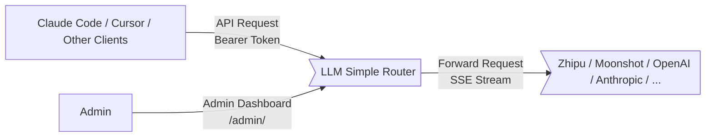
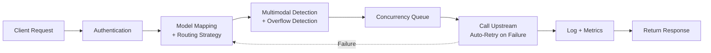

**[English](README.en.md)** | **[中文](README.md)**

# LLM Simple Router

An LLM API proxy router that receives requests from clients like Claude Code and Cursor, forwards them to configured backend Providers through model mapping and routing strategies, supporting both streaming (SSE) and non-streaming proxying.

**Core problem it solves**: Chinese domestic models have frequent rate limits, switching between multiple providers is cumbersome, and concurrency control is missing.

## Who Is This For

- Developers using Claude Code / Cursor / Codex / Pi with Chinese domestic models (Zhipu, Moonshot, Minimax, etc.)
- Those who want automatic retries for rate-limit errors, scenario-based model switching, and concurrency queue management
- Anyone looking for a turnkey solution without the hassle

## Feature Overview

### Core Features

| Feature | Description |
|---------|-------------|
| Automatic error retries | Exponential backoff retries for recoverable errors (429/400/network timeouts), completely transparent to the client |
| Concurrency queue | Per-Provider concurrency limits with queueing; supports adaptive concurrency that auto-adjusts based on load, no manual tuning needed |
| Multi-API format support | Supports OpenAI (Chat Completions, Responses) and Anthropic (Messages) — client and upstream formats can be freely combined. Built-in DeepSeek reasoning_thinking patches |
| Stream response timeout | Per-model configurable stream timeout to prevent stuck connections when the model stops producing output |
| Real-time monitoring | SSE-based live view of active requests, queue status, and streaming output with structured display adapted for Claude Code |
| Request logs | Full four-stage tracing (client request → upstream request → upstream response → client response), with log file archiving |

### Additional Features

| Feature | Description |
|---------|-------------|
| Rich model auto-switching | Failover, context overflow auto-switch to larger context models, multimodal request auto-switch, time-based scheduled switching |
| Quick setup | Select client → select provider → enter API key, done in 3 steps. Pre-configured parameters for Zhipu, Moonshot, Minimax and other domestic providers |
| Provider network proxy | Per-provider HTTP/SOCKS5 proxy for overseas APIs (OpenAI, Anthropic) |
| Proxy enhancement (experimental) | Tool call loop detection (N-gram) + Token usage estimation + Cache hit rate estimation |
| Usage dashboard | Usage statistics by time, model, and key dimensions; 5-hour sliding window optimized for Coding Plans |
| Multi-key management | Independent Router keys + model whitelists (allowed_models) for multi-user/multi-project isolation |
| Upgrade notifications | Automatic new version notifications + one-click upgrade |

> **API Compatibility:** Supports both Anthropic and OpenAI API formats. Client and upstream formats can be freely combined. Google Gemini API format is not yet supported.

## Admin Dashboard

| Provider Management + Concurrency Control | Real-time Monitoring |
|---|---|
|  |  |

| Model Mapping | Retry Rules |
|---|---|
|  |  |

| Dashboard | Request Logs |
|---|---|
|  |  |

| Proxy Enhancement (Experimental) |
|----------------------------------|
|  |

## Quick Start

### 1. Start Router

```bash
npx llm-simple-router
```

Visit http://localhost:9981/admin. On first visit, the Setup page will ask you to set an admin password. Data is stored in `~/.llm-simple-router/`.

### 2. Configure Provider

Admin Dashboard > Providers page > Add Provider. Select a Coding Plan to auto-fill the Base URL, then just enter the API Key.

You can also use the Quick Setup page: select client → select provider → enter API key, done in 3 steps.

### 3. Configure Model Mapping

Admin Dashboard > Model Mappings page.

**Core concept:** The client sends a request with model name A. The Router replaces it with backend model name B according to the mapping rule, then forwards the request:

```
Claude Code (model A) → Router (A → B) → Provider API (model B)
```

Simply configure "client model = A, backend model = B, select provider" in the mapping table.

#### Claude Code Default Model Names

When no environment variables are set, Claude Code uses these default model names: `opus`, `sonnet`, `haiku`. If the backend is a Zhipu Coding Plan, the mapping configuration would be:

| Client Model | Backend Model | Provider | Time Window |
|-------------|--------------|----------|-------------|
| opus | glm-5.1 | Zhipu Coding Plan | All day |
| sonnet | glm-5.1 | Zhipu Coding Plan | All day |
| haiku | glm-5-turbo | Zhipu Coding Plan | All day |

You can also use time-based switching for peak hours:

| Client Model | Backend Model | Provider | Time Window |
|-------------|--------------|----------|-------------|
| sonnet | glm-5.1 | Zhipu Coding Plan | 00:00-14:00 |
| sonnet | kimi-for-coding | Moonshot | 14:00-18:00 |
| sonnet | glm-5.1 | Zhipu Coding Plan | 18:00-24:00 |

### 4. Configure Claude Code

Create a Router API key in the admin dashboard, then choose one of the following methods. **Only one is needed.**

**Option 1: shell alias (recommended)**

Minimal configuration. Claude Code uses default model names (opus / sonnet / haiku), and the Router converts them via the mapping table:

```bash
alias clode='\
export ANTHROPIC_AUTH_TOKEN="<your-router-key>" && \
export ANTHROPIC_BASE_URL="http://127.0.0.1:9981" && \
claude'
```

You can also specify model names directly via environment variables, bypassing Router mapping:

```bash
alias clode='\
export ANTHROPIC_AUTH_TOKEN="sk-router-xxxxxxxx" && \
export ANTHROPIC_BASE_URL="http://192.168.1.111:9981" && \
export ANTHROPIC_MODEL="glm-5" && \
export ANTHROPIC_DEFAULT_OPUS_MODEL="glm-5.1" && \
export ANTHROPIC_DEFAULT_SONNET_MODEL="glm-5" && \
export ANTHROPIC_DEFAULT_HAIKU_MODEL="glm-5-turbo" && \
export ANTHROPIC_SMALL_FAST_MODEL="glm-5-turbo" && \
claude'
```

> For debugging, add: `claude --dangerously-skip-permissions --verbose --debug`, or set `export DEBUG=claude:*` for detailed logs.

**Option 2: ~/.claude/settings.json**

Add the configuration to the `env` field in `~/.claude/settings.json` (same effect as exporting environment variables):

Minimal configuration:

```json
{
  "env": {
    "ANTHROPIC_AUTH_TOKEN": "<your-router-key>",
    "ANTHROPIC_BASE_URL": "http://127.0.0.1:9981"
  }
}
```

Override model names:

```json
{
  "env": {
    "ANTHROPIC_AUTH_TOKEN": "sk-router-xxxxxxxx",
    "ANTHROPIC_BASE_URL": "http://192.168.1.111:9981",
    "ANTHROPIC_MODEL": "glm-5",
    "ANTHROPIC_DEFAULT_OPUS_MODEL": "glm-5.1",
    "ANTHROPIC_DEFAULT_SONNET_MODEL": "glm-5",
    "ANTHROPIC_DEFAULT_HAIKU_MODEL": "glm-5-turbo",
    "ANTHROPIC_SMALL_FAST_MODEL": "glm-5-turbo"
  }
}
```

> Environment variables in settings.json apply to all projects. To apply only to the current project, place them in `.claude/settings.json` (in the project root).

### 5. Configure Codex

Edit `~/.codex/config.toml` to add the Router as a custom provider:

```toml
model_provider = "llm-simple-router"
model = "deepseek-v4-flash"
preferred_auth_method = "apikey"

[model_providers.llm-simple-router]
name = "LLMSimpleRouter"
base_url = "http://127.0.0.1:9981/v1"
env_key = "ROUTER_KEY"
wire_api = "responses"
```

Set the environment variable (your Router API key):

```bash
export ROUTER_KEY="<your-router-key>"
```

> Codex connects to Router via OpenAI Responses API (`wire_api = "responses"`). The `model` field should be the client model name configured in Router.

### 6. Configure Pi Coding Agent

Edit `~/.pi/agent/models.json` to add the Router as a provider:

```json
{
  "providers": {
    "llm-simple-router": {
      "baseUrl": "http://127.0.0.1:9981",
      "api": "anthropic-messages",
      "apiKey": "<your-router-key>",
      "models": [
        {
          "id": "glm-5.1",
          "name": "glm-5.1",
          "reasoning": true,
          "input": ["text"],
          "contextWindow": 200000,
          "maxTokens": 64000
        },
        {
          "id": "deepseek-v4-flash",
          "name": "deepseek-v4-flash",
          "reasoning": true,
          "input": ["text"],
          "contextWindow": 1000000,
          "maxTokens": 64000,
          "compat": {
            "requiresReasoningContentOnAssistantMessages": true,
            "thinkingFormat": "deepseek"
          },
          "thinkingLevelMap": {
            "off": null,
            "minimal": null,
            "low": null,
            "medium": null,
            "high": "high",
            "xhigh": "max"
          }
        }
      ]
    }
  }
}
```

> Pi connects to Router via Anthropic Messages API (`api: "anthropic-messages"`). DeepSeek models require `compat.thinkingFormat: "deepseek"` and `thinkingLevelMap` to correctly handle reasoning output.

### 7. Use

```bash
# Claude Code (shell alias)
clode

# Claude Code (settings.json)
claude

# Codex
codex

# Pi Coding Agent
pi
```

## Docker Deployment

**Option 1: Pull pre-built image (recommended)**

```bash
# One-click start with data persistence to ~/.llm-simple-router/
docker compose up -d
```

`docker-compose.yml` pulls the pre-built image from ghcr.io by default, with data mapped to `~/.llm-simple-router/` on the host.

You can also use `docker run` directly:

```bash
docker run -d \
  --name llm-router \
  -p 9981:9981 \
  -v ~/.llm-simple-router:/app/data \
  -e DB_PATH=/app/data/router.db \
  -e TZ=Asia/Shanghai \
  --restart unless-stopped \
  ghcr.io/zhushanwen321/llm-simple-router:latest
```

Environment variables are set through the Setup page; no `.env` file needed.

**Option 2: Build locally**

Edit `docker-compose.yml`, comment out the `image` line, uncomment the `build` section, then:

```bash
docker compose up -d --build
```

## Process Management

After upgrading via the Web UI, the service needs to restart. Use one of the following deployment methods to ensure automatic recovery after crashes or upgrades.

### PM2 (recommended)

```bash
# Install PM2
npm install -g pm2

# Install Router globally
npm install -g llm-simple-router

# Start (PM2 auto-restarts crashed processes)
pm2 start llm-simple-router --name llm-router

# View logs
pm2 logs llm-router

# Enable startup on boot
pm2 startup
pm2 save
```

Upgrade flow: Web UI one-click upgrade → click restart → PM2 auto-spawns new process (< 1s interruption).

### systemd (Linux servers)

Create service file `/etc/systemd/system/llm-simple-router.service`:

```ini
[Unit]
Description=LLM Simple Router
After=network.target

[Service]
Type=simple
ExecStart=/usr/local/bin/llm-simple-router
Restart=always
RestartSec=3
Environment=PORT=9981
Environment=LOG_LEVEL=info
# Configure other environment variables as needed
# Environment=DB_PATH=/var/lib/llm-simple-router/router.db

[Install]
WantedBy=multi-user.target
```

> **Note**: The `ExecStart` path depends on how Node.js is installed. Use `which llm-simple-router` to find the actual path.

```bash
# Enable and start
sudo systemctl enable llm-simple-router
sudo systemctl start llm-simple-router

# Check status and logs
sudo systemctl status llm-simple-router
journalctl -u llm-simple-router -f
```

Upgrade flow: Web UI one-click upgrade → click restart → systemd auto-restarts (< 1s interruption).

### npx / Manual start

No extra configuration needed. After Web UI upgrade and clicking restart, the Router will automatically spawn a new process and exit the old one. Brief interruption of about 1-2 seconds.

> **Note**: If you directly `Ctrl+C` or close the terminal, the service won't auto-recover. Use PM2 or systemd for production.

## How It Works

```
Claude Code → Router (model mapping + auto-retry + concurrency control) → Zhipu GLM / Kimi / Other Providers
```

### Architecture Diagram

**System Context** ([details](docs/system-context.md)):



**Request Processing Pipeline** ([details](docs/request-pipeline.md)):



When the Router receives a request: Authentication → find backend Provider via mapping rules → multimodal detection (auto-switch to fallback model for images/audio) → context overflow detection → queue for concurrency control → forward to upstream (auto-retry on failure; under Failover strategy, switches Provider) → log and record metrics → return response.

## Environment Variables

All secrets are set through the Setup page. Optional configuration:

| Variable | Default | Description |
|----------|---------|-------------|
| `PORT` | `9981` | Server port |
| `DB_PATH` | `~/.llm-simple-router/router.db` | SQLite database path |
| `LOG_LEVEL` | `info` | Log level |
| `TZ` | `Asia/Shanghai` | Timezone |
| `STREAM_TIMEOUT_MS` | `3000000` | Stream proxy idle timeout (ms) |
| `RETRY_MAX_ATTEMPTS` | `3` | Max retry attempts |
| `RETRY_BASE_DELAY_MS` | `1000` | Retry base delay (ms) |

## Development

```bash
# Backend (hot reload)
npm run dev

# Frontend (hot reload, proxies API to backend :9980)
cd frontend && npm run dev

# Build
npm run build:full

# Test
npm test

# Lint
npm run lint
```

## Contact & Community

<table>
  <tr>
    <td align="center">
      <br/>
      <b>QQ</b><br/>
      <sub>541815155</sub>
    </td>
    <td align="center">
      <br/>
      <b>Feishu</b><br/>
      <sub>Xu Ditao (Lao Ba)</sub>
    </td>
    <td align="center">
      <br/>
      <b>Feishu Group</b><br/>
      <sub>Scan to join</sub>
    </td>
  </tr>
</table>

## License

MIT
