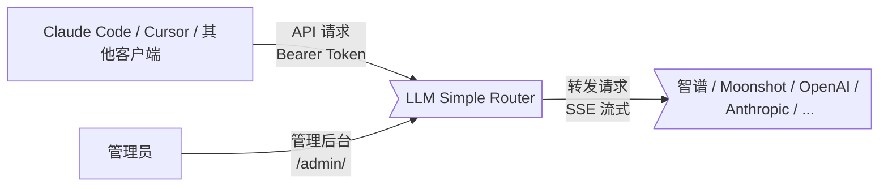
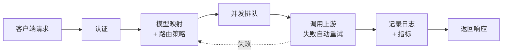

# LLM Simple Router

> **Status: Active Development**
>
> 核心代理、模型映射、自动重试、多密钥管理、请求日志、性能指标已完成。
> 代码规范 githook 检查已集成。欢迎试用和反馈。

## 解决的核心问题

个人使用 Claude Code 配合国产模型时的实际痛点：

- **自动重试** — 国产模型限流、网络错误频繁，对可恢复错误（429/400/网络超时）自动指数退避重试。默认已经针对智谱模型进行了配置，开箱即用。
- **多供应商支持** — 支持智谱、Moonshot、Minimax、火山引擎、阿里云、腾讯云等，Coding Plan 选择后会自动填写，只需要配置 API Key。也可以完全自定义。
- **模型分时段映射** — 可以每天分时段自动切换模型。以我自己使用体验来说，平时将 sonnet 映射到 glm-5.1 ，14-18点将 sonnet 映射到 kimi ，减少智谱高峰期限流错误和三倍消耗。
- **并发队列等待** — 不同 Provider 可以配置并发数限制，超过限制的请求会进入队列等待。解决 Claude Code 多个subagent并行执行时经常触发限流失败的问题。不过需要配置 claude code 的 API_TIMEOUT_MS 为一个比较大的值。这个功能可以让使用 Claude Code 体验更好，但不能根本性解决限流问题。
- **实时请求监控** — 实时监控活跃请求、队列情况，可以实时查看流式请求的输出并结构化展示（目前仅支持 Claude Code ）。

## 其他功能

| 功能 | 说明 |
|------|------|
| 多密钥 | 为不同使用方创建独立密钥，支持模型白名单 |
| 代理增强 (实验性) | 支持通过 Claude Code 发送select-model指令直接变更 router 的模型，不经过 LLM 请求（实验中，可能有bug） |
| 请求日志 | 结构化展示完整四阶段链路（客户端请求/上游请求/上游响应/客户端响应），适配 Claude Code 请求格式 |
| 性能指标 | TTFT、吞吐量、Token 用量、缓存命中率，支持按模型/密钥筛选 |

> **API 兼容性：** 支持 Anthropic 兼容 API（已适配 Claude Code）。OpenAI 兼容 API（`/v1/chat/completions`）尚未充分测试。

## 管理后台预览

| Provider 管理和并发控制 |
|-----------|
|  |

| 实时监控 |
|-----------------|
|  |

| 模型映射 |
|---------|
|  |

| 重试规则 |
|---------|
|  |

| Dashboard | 请求日志 |
|--------------|---------|
|  |  |

| 代理增强 (实验性) |
|-----------------|
|  |

## 工作原理

```
Claude Code -> Router (模型映射 + 自动重试 + 并发控制) -> 智谱 GLM / Kimi / 其他供应商
```

Router 根据模型映射找到后端供应商 -> 转发请求 -> 自动重试失败请求 -> 记录日志和性能指标 -> 返回响应。

### 架构图

**系统上下文**（[详细说明](docs/system-context.md)）：



**请求处理流水线**（[详细说明](docs/request-pipeline.md)）：


Router 收到请求后：认证 → 按映射规则找到后端 Provider → 排队控制并发 → 转发到上游（失败自动重试，Failover 策略下会切换 Provider）→ 记录日志和指标 → 返回响应。

## 快速开始

### npx 启动
```bash
# 一行命令启动
npx llm-simple-router
# 访问 http://localhost:9981/admin
# 首次访问会进入 Setup 页面设置管理员密码
```

无需任何环境变量。数据默认存储在 `~/.llm-simple-router/`。

### Docker 部署

```bash
docker compose up -d
```
### 创建 Router API 密钥

在管理后台创建一个 API 密钥，原先 Claude Code 密钥替换为 Router 密钥。

**方式一：shell alias（推荐）**

```bash
alias clodedev='ANTHROPIC_AUTH_TOKEN="<your-router-key>" ANTHROPIC_BASE_URL="http://127.0.0.1:9981" claude'
```

**方式二：~/.claude/settings.json**

```json
{
  "env": {
    "ANTHROPIC_AUTH_TOKEN": "sk-router-change-me",
    "ANTHROPIC_BASE_URL": "http://127.0.0.1:9981",
    "ANTHROPIC_MODEL": "some-model"
  }
}
```

### 管理后台配置 Provider

Provider 支持快速配置，目前支持智谱、Moonshot、Minimax、火山引擎、阿里云、腾讯云等，Coding Plan 选择后会自动填写，只需要配置 API Key。

### 管理后台配置模型映射

| 客户端模型 | 后端模型 | 供应商 | 时间窗口 |
|-----------|---------|--------|---------|
| opus | glm-5.1 | 智谱 | / |
| sonnet | glm-5.1 | 智谱 | / |
| sonnet | kimi-for-coding | Moonshot | 14:00-18:00 |
| sonnet | glm-5-turbo | 智谱 | / |

客户端模型是指 Claude Code 实际请求发出的模型名。
如果你配置了 ANTHROPIC_MODEL 等变量，那应该以该变量为准。
个人的配置：高峰期 GLM 3倍用量，且频繁超限时，将 sonnet 切到 Kimi；低谷期切回 GLM。

## 环境变量

所有密钥（管理员密码、加密密钥、JWT 密钥）通过首次启动的 Setup 页面设置，无需环境变量。

| 变量 | 必需 | 默认值 | 说明 |
|------|------|--------|------|
| `PORT` | No | `9981` | 服务端口 |
| `DB_PATH` | No | `~/.llm-simple-router/router.db` | SQLite 数据库路径 |
| `LOG_LEVEL` | No | `info` | 日志级别 |
| `TZ` | No | `Asia/Shanghai` | 时区设置 |
| `STREAM_TIMEOUT_MS` | No | `3000000` | 流式代理空闲超时（ms） |
| `RETRY_MAX_ATTEMPTS` | No | `3` | 最大重试次数 |
| `RETRY_BASE_DELAY_MS` | No | `1000` | 重试基础延迟（ms） |
