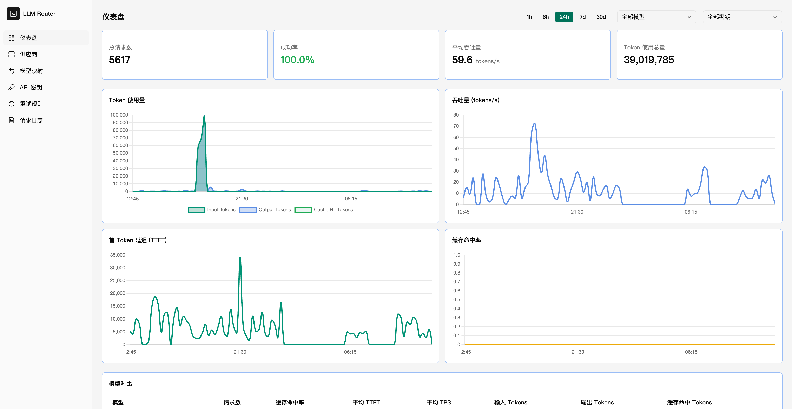
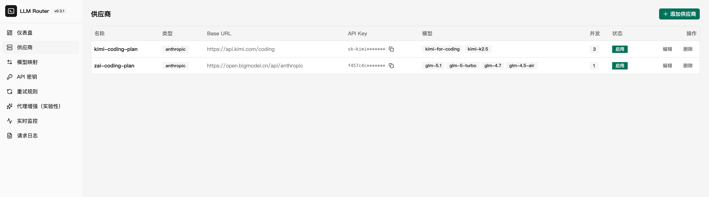
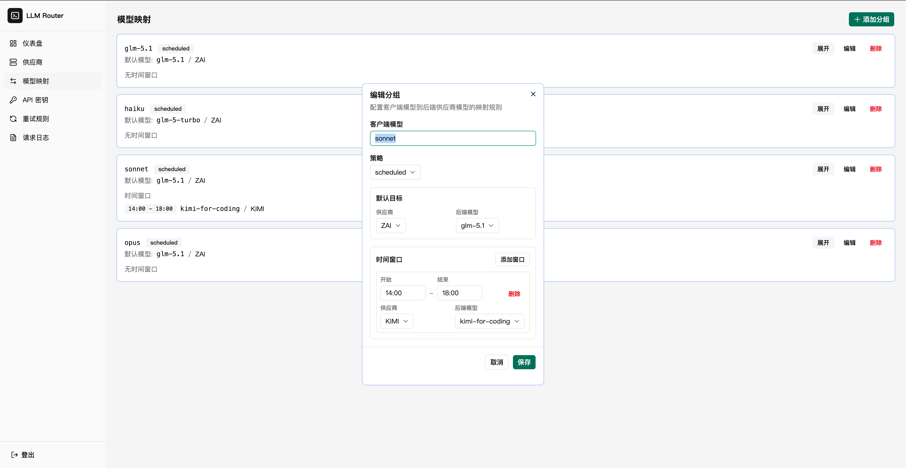
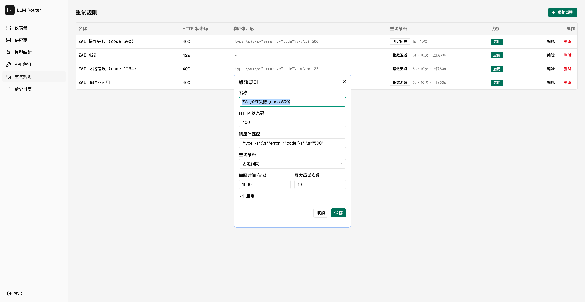

# LLM Simple Router

> **Status: Active Development**
>
> 核心代理、模型映射、自动重试、多密钥管理、请求日志、性能指标已完成。
> 代码规范 githook 检查已集成。欢迎试用和反馈。

## 解决的核心问题

个人使用 Claude Code 配合国产模型时的实际痛点：

- **自动重试** — 国产模型限流、网络错误频繁，对可恢复错误（429/500/网络超时）自动指数退避重试
- **多供应商模型映射** — 高峰期主模型不可用时，将 claude-opus 映射到 GLM，claude-sonnet 映射到 Kimi 等，低谷期再切回来
- **多密钥隔离** — 为不同使用方分配独立密钥，按密钥筛选日志和性能指标

## 功能

| 功能 | 说明 |
|------|------|
| 模型映射 | 客户端模型名 -> 后端模型名 + 供应商，支持分组和优先级 |
| 自动重试 | 429/500/网络错误自动重试，指数退避，可配置次数和间隔 |
| 多供应商 | 配置多个后端供应商，按模型映射路由 |
| 多密钥 (Router Keys) | 为不同使用方创建独立密钥，支持模型白名单 |
| 流式代理 | 完整支持 SSE 流式和非流式请求 |
| 管理后台 | Vue 3 + shadcn-vue Web UI，管理供应商、映射、密钥 |
| 请求日志 | 结构化展示完整四阶段链路（客户端请求/上游请求/上游响应/客户端响应），适配 Claude Code 请求格式 |
| 性能指标 | TTFT、吞吐量、Token 用量、缓存命中率，支持按模型/密钥筛选 |

> **API 兼容性：** 支持 Anthropic 兼容 API（已适配 Claude Code）。OpenAI 兼容 API（`/v1/chat/completions`）尚未充分测试。

## 管理后台预览

| Dashboard | Provider 管理 |
|-----------|-------------|
|  |  |

| 模型映射 | 重试规则 |
|---------|--------|
|  |  |

| 请求日志 |
|---------|
|  |

## 工作原理

```
Claude Code -> Router (模型映射 + 自动重试) -> 智谱 GLM / Kimi / 其他供应商
```

Router 根据模型映射找到后端供应商 -> 转发请求 -> 自动重试失败请求 -> 记录日志和性能指标 -> 返回响应。

## 典型使用场景

### Claude Code 配置

通过环境变量将 Claude Code 指向 Router：

**方式一：shell alias（推荐）**

```bash
alias clodedev='ANTHROPIC_AUTH_TOKEN="<your-router-key>" ANTHROPIC_BASE_URL="http://127.0.0.1:3000" claude'
```

**方式二：package.json script**

```json
{
  "scripts": {
    "clodedev": "ANTHROPIC_AUTH_TOKEN=\"<your-router-key>\" ANTHROPIC_BASE_URL=\"http://127.0.0.1:3000\" claude"
  }
}
```

将 `<your-router-key>` 替换为管理后台中创建的 Router Key。

### 管理后台配置模型映射

| 客户端模型 | 后端模型 | 供应商 |
|-----------|---------|--------|
| claude-opus-4-20250514 | glm-4-plus | 智谱 |
| claude-sonnet-4-20250514 | kimi-k2-0711 | Moonshot |

高峰期 GLM 频繁超限时，将 sonnet 切到 Kimi；低谷期切回 GLM。

## 快速开始

```bash
npm install
cp .env.example .env
# 编辑 .env，设置 ADMIN_PASSWORD、ENCRYPTION_KEY、JWT_SECRET
npm run dev
# 访问 http://localhost:3000/admin
```

生成随机密钥：`openssl rand -hex 32`

## Docker 部署

```bash
docker compose up -d
```

## 环境变量

| 变量 | 必需 | 默认值 | 说明 |
|------|------|--------|------|
| `ADMIN_PASSWORD` | Yes | -- | 管理后台密码 |
| `ENCRYPTION_KEY` | Yes | -- | AES-256-GCM 密钥（64字符 hex） |
| `JWT_SECRET` | Yes | -- | JWT 签名密钥（64字符 hex） |
| `PORT` | No | `3000` | 服务端口 |
| `DB_PATH` | No | `./data/router.db` | SQLite 数据库路径 |
| `LOG_LEVEL` | No | `info` | 日志级别 |
| `TZ` | No | -- | 时区设置 |
| `STREAM_TIMEOUT_MS` | No | `3000000` | 流式代理空闲超时（ms） |
| `RETRY_MAX_ATTEMPTS` | No | `3` | 最大重试次数 |
| `RETRY_BASE_DELAY_MS` | No | `1000` | 重试基础延迟（ms） |
