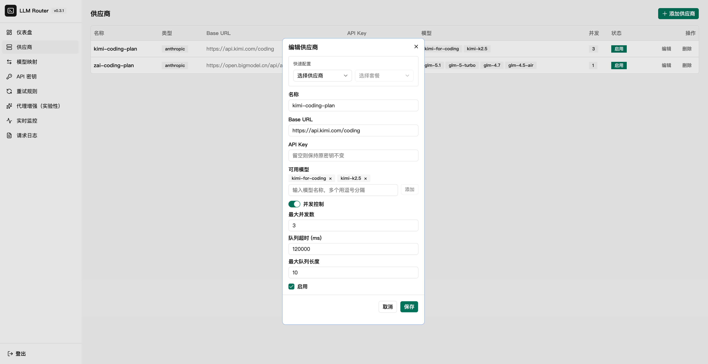
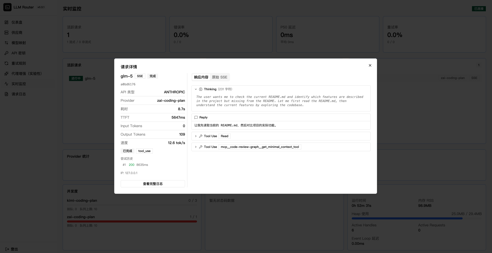
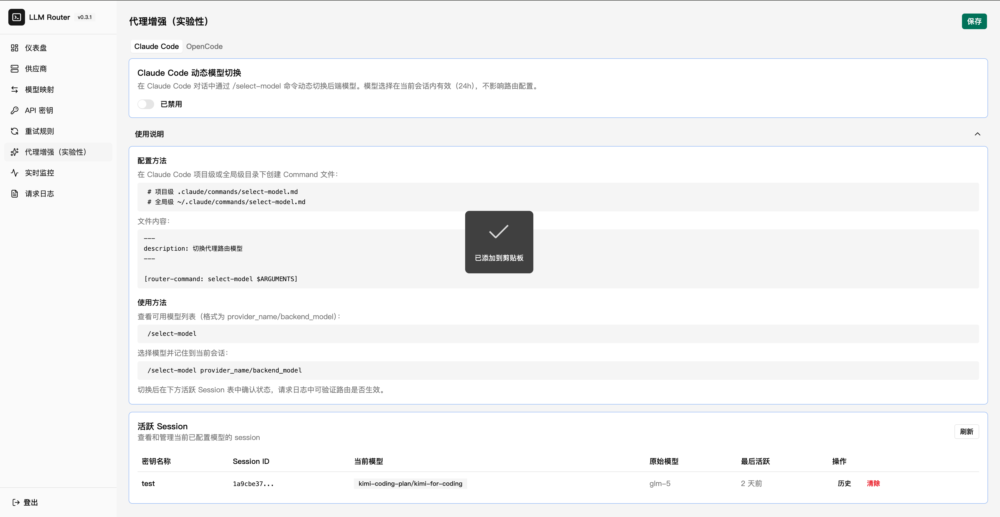
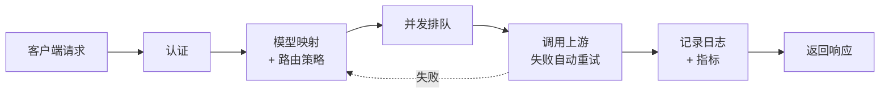

# LLM Simple Router

LLM API 代理路由器。接收 Claude Code / Cursor 等客户端请求，通过模型映射和路由策略转发到配置的后端 Provider，支持流式（SSE）和非流式代理。

**解决的核心问题**：国产模型限流频繁、多供应商切换麻烦、并发控制缺失。

## 适合谁

- 用 Claude Code 配合国产模型（智谱、Moonshot、Minimax 等）的开发者
- 希望自动重试限流错误、分时段切换模型、控制并发排队
- 想要一个开箱即用的方案，不折腾

## 功能一览

| 功能 | 说明 |
|------|------|
| 自动重试 | 对 429/400/网络超时自动指数退避重试，默认针对智谱模型配置 |
| 多供应商支持 | 智谱、Moonshot、Minimax、火山引擎、阿里云、腾讯云等，Coding Plan 选择后自动填写 |
| 模型分时段映射 | 按时间段自动切换后端模型（如高峰期切到 Kimi，低谷期切回 GLM） |
| 并发队列等待 | 按 Provider 配置并发数上限，超限请求排队等待 |
| Failover 故障转移 | 多 Provider 互备，失败自动切换下一个 |
| 实时请求监控 | SSE 推送活跃请求、队列状态、流式输出实时查看 |
| 多密钥管理 | 独立密钥 + 模型白名单，支持多用户/多项目 |
| 请求日志 | 四阶段完整链路（客户端请求/上游请求/上游响应/客户端响应） |
| 性能指标 | TTFT、TPS、Token 用量、缓存命中率 |

> **API 兼容性：** 支持 Anthropic 兼容 API（已适配 Claude Code）。OpenAI 兼容 API（`/v1/chat/completions`）尚未充分测试。

## 管理后台

| Provider 管理 + 并发控制 | 实时监控 |
|---|---|
|  |  |

| 模型映射 | 重试规则 |
|---|---|
|  |  |

| Dashboard | 请求日志 |
|---|---|
|  |  |

| 代理增强 (实验性) |
|-----------------|
|  |

## 快速开始

### 1. 启动 Router

```bash
npx llm-simple-router
```

访问 http://localhost:9981/admin ，首次进入 Setup 页面设置管理员密码。数据存储在 `~/.llm-simple-router/`。

### 2. 配置 Provider

管理后台 > Provider 页面 > 添加 Provider。选择 Coding Plan 后会自动填写 Base URL，只需填入 API Key。

### 3. 配置模型映射

管理后台 > 模型映射页面。示例配置：

| 客户端模型 | 后端模型 | 供应商 | 时间窗口 |
|-----------|---------|--------|---------|
| sonnet | glm-5.1 | 智谱 | 全天 |
| sonnet | kimi-for-coding | Moonshot | 14:00-18:00 |

客户端模型是指 Claude Code 实际请求的模型名（由 `ANTHROPIC_MODEL` 等环境变量决定）。

### 4. 配置 Claude Code

在管理后台创建 Router API 密钥，然后选择一种方式配置：

**方式一：shell alias（推荐）**

```bash
alias clode='\
export ANTHROPIC_AUTH_TOKEN="<your-router-key>" && \
export ANTHROPIC_BASE_URL="http://127.0.0.1:9981" && \
export ANTHROPIC_MODEL="<your-default-model>" && \
export ANTHROPIC_DEFAULT_OPUS_MODEL="<your-opus-model>" && \
export ANTHROPIC_DEFAULT_SONNET_MODEL="<your-sonnet-model>" && \
export ANTHROPIC_DEFAULT_HAIKU_MODEL="<your-haiku-model>" && \
export ANTHROPIC_SMALL_FAST_MODEL="<your-fast-model>" && \
claude'
```

**方式二：~/.claude/settings.json**

```json
{
  "env": {
    "ANTHROPIC_AUTH_TOKEN": "<your-router-key>",
    "ANTHROPIC_BASE_URL": "http://127.0.0.1:9981",
    "ANTHROPIC_MODEL": "<your-default-model>",
    "ANTHROPIC_DEFAULT_OPUS_MODEL": "<your-opus-model>",
    "ANTHROPIC_DEFAULT_SONNET_MODEL": "<your-sonnet-model>",
    "ANTHROPIC_DEFAULT_HAIKU_MODEL": "<your-haiku-model>",
    "ANTHROPIC_SMALL_FAST_MODEL": "<your-fast-model>"
  }
}
```

### 5. 使用

```bash
# 方式一用户直接用 alias
clode

# 方式二用户正常启动 claude
claude
```

## Docker 部署

```bash
docker compose up -d
```

环境变量通过 Setup 页面设置，不需要 `.env` 文件。

## 工作原理

```
Claude Code → Router (模型映射 + 自动重试 + 并发控制) → 智谱 GLM / Kimi / 其他供应商
```

Router 根据模型映射找到后端供应商 → 转发请求 → 自动重试失败请求 → 记录日志和性能指标 → 返回响应。

### 架构图

**系统上下文**（[详细说明](docs/system-context.md)）：


**请求处理流水线**（[详细说明](docs/request-pipeline.md)）：



Router 收到请求后：认证 → 按映射规则找到后端 Provider → 排队控制并发 → 转发到上游（失败自动重试，Failover 策略下会切换 Provider）→ 记录日志和指标 → 返回响应。

## 环境变量

所有密钥通过 Setup 页面设置，以下为可选配置：

| 变量 | 默认值 | 说明 |
|------|--------|------|
| `PORT` | `9981` | 服务端口 |
| `DB_PATH` | `~/.llm-simple-router/router.db` | SQLite 数据库路径 |
| `LOG_LEVEL` | `info` | 日志级别 |
| `TZ` | `Asia/Shanghai` | 时区设置 |
| `STREAM_TIMEOUT_MS` | `3000000` | 流式代理空闲超时（ms） |
| `RETRY_MAX_ATTEMPTS` | `3` | 最大重试次数 |
| `RETRY_BASE_DELAY_MS` | `1000` | 重试基础延迟（ms） |

## 开发

```bash
# 后端（热重载）
npm run dev

# 前端（热重载，代理 API 到后端 :9980）
cd frontend && npm run dev

# 构建
npm run build:full

# 测试
npm test

# Lint
npm run lint
```

## License

MIT
