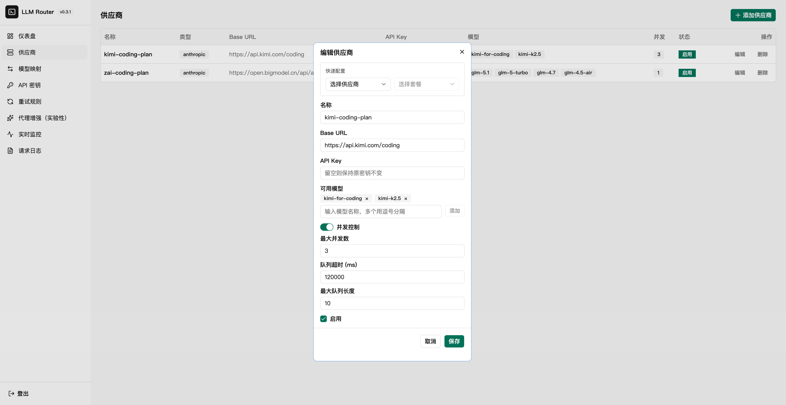
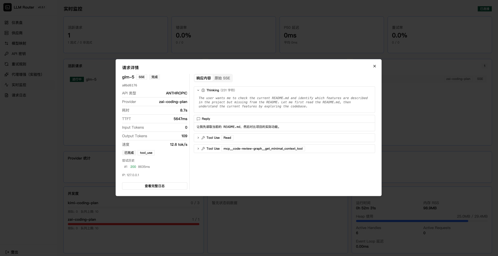
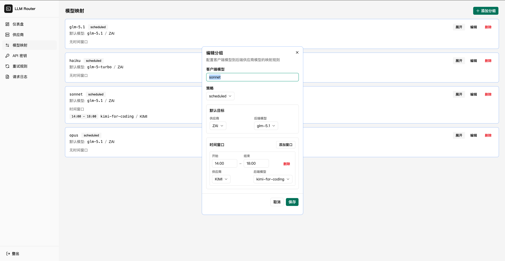
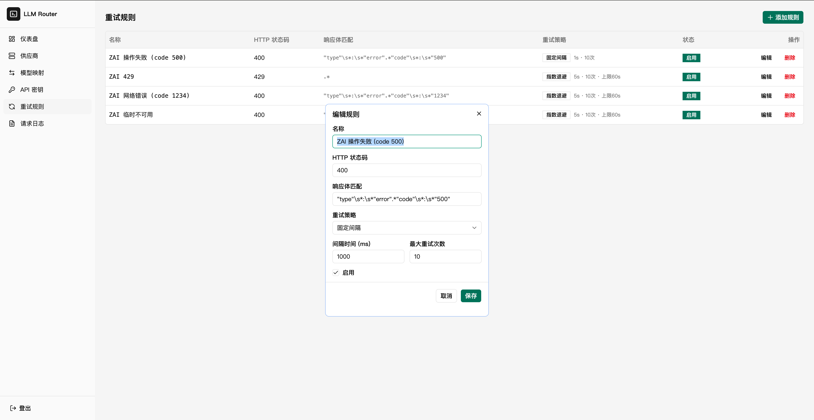
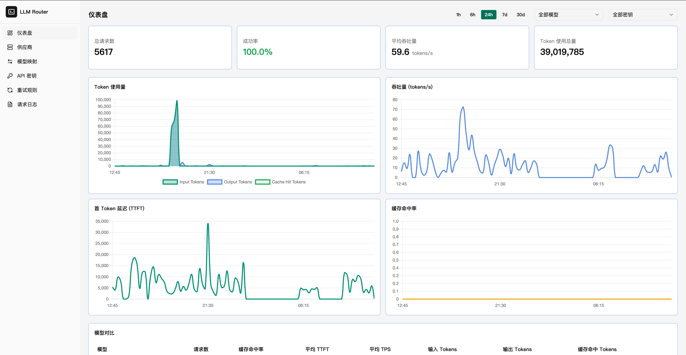
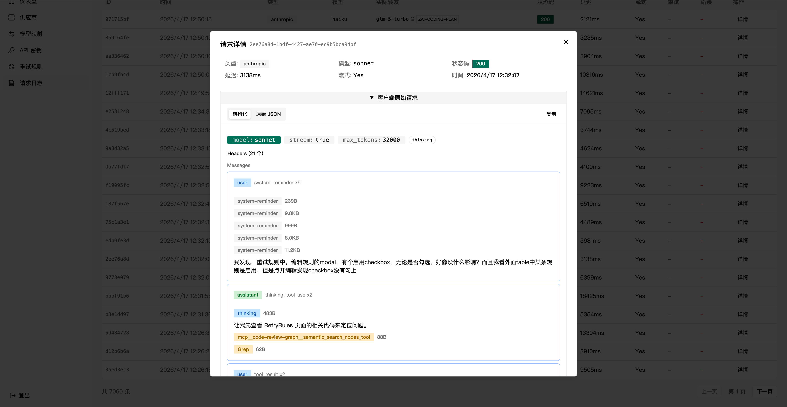
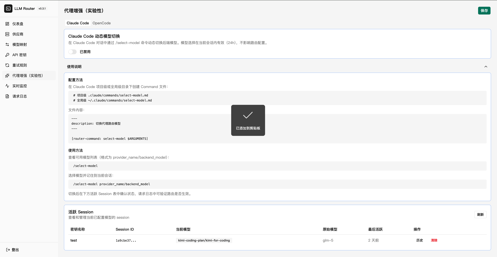
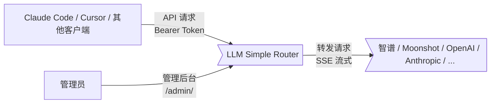
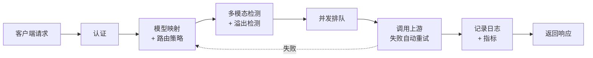

**[English](README.en.md)** | **[中文](README.md)**

# LLM Simple Router

LLM API 代理路由器。接收 Claude Code / Cursor 等客户端请求，通过模型映射和路由策略转发到配置的后端 Provider，支持流式（SSE）和非流式代理。

**解决的核心问题**：国产模型限流频繁、多供应商切换麻烦、并发控制缺失。

## 适合谁

- 用 Claude Code / Cursor / Codex / Pi 配合国产模型（智谱、Moonshot、Minimax 等）的开发者
- 希望自动重试限流错误、按场景切换模型、控制并发排队
- 想要一个开箱即用的方案，不折腾

## 功能一览

### 核心功能

| 功能 | 说明 |
|------|------|
| 错误自动重试 | 对 429/400/网络超时等可恢复错误自动指数退避重试，客户端完全无感 |
| 并发队列等待 | 按 Provider 配置并发上限，超限请求排队等待；支持自适应并发，根据负载自动调整，无需手动调参 |
| 多 API 格式支持 | 支持 OpenAI（Chat Completions、Responses）和 Anthropic（Messages）三种接口，客户端与上游格式可任意组合。内置 DeepSeek reasoning_thinking 补丁，支持DS和其他模型混用切换 |
| 流式响应超时 | 每个模型可单独设置流式超时，防止模型卡死不输出导致请求挂起 |
| 实时请求监控 | SSE 推送活跃请求、队列状态、流式输出实时查看，结构化展示适配 Claude Code 输出格式 |
| 请求日志 | 四阶段完整链路（客户端请求 → 上游请求 → 上游响应 → 客户端响应），支持日志文件归档 |

### 其他功能

| 功能 | 说明 |
|------|------|
| 丰富的模型自动切换 | 故障转移（Failover）、上下文溢出自动切大窗口模型、多模态请求自动切多模态模型、分时段定时切换 |
| 快速配置 | 选客户端 → 选供应商 → 填 API Key，三步完成配置。预置智谱、Moonshot、Minimax 等国内供应商参数 |
| 供应商网络代理 | 针对境外 API（OpenAI、Anthropic）可单独配置 HTTP/SOCKS5 代理 |
| 代理增强（实验性） | 工具调用循环检测（N-gram）+ Token 用量预估 + 缓存命中率预估 |
| 用量大盘 | 按时间、模型、密钥等维度查看用量统计，5 小时滑动窗口适配 Coding Plan |
| 多密钥管理 | 独立 Router 密钥 + 模型白名单（allowed_models），支持多用户/多项目隔离 |
| 升级通知 | 新版本自动提醒 + 一键升级 |

> **API 兼容性：** 同时支持 Anthropic 和 OpenAI 两种 API 格式，客户端和上游格式可任意组合。暂不支持 Google Gemini API 格式。

## 管理后台

| Provider 管理 + 并发控制 | 实时监控 |
|---|---|
|  |  |

| 模型映射 | 重试规则 |
|---|---|
|  |  |

| Dashboard | 请求日志 |
|---|---|
|  |  |

| 代理增强 (实验性) |
|-----------------|
|  |

## 快速开始

### 1. 启动 Router

```bash
npx llm-simple-router
```

访问 http://localhost:9981/admin ，首次进入 Setup 页面设置管理员密码。数据存储在 `~/.llm-simple-router/`。

### 2. 配置 Provider

管理后台 > Provider 页面 > 添加 Provider。选择 Coding Plan 后会自动填写 Base URL，只需填入 API Key。

也可以使用快速配置页面：选客户端 → 选供应商 → 填 API Key，三步完成。

### 3. 配置模型映射

管理后台 > 模型映射页面。

**核心概念：** 客户端请求携带模型名 A，Router 根据映射规则将其替换为后端 Provider 支持的模型名 B，然后转发请求：

```
Claude Code (模型 A) → Router (A → B) → Provider API (模型 B)
```

只需在映射表中配置「客户端模型 = A，后端模型 = B，选择供应商」即可。

#### Claude Code 默认模型名

Claude Code 未设置环境变量时，默认使用以下模型名：`opus`、`sonnet`、`haiku`。如果后端是智谱 Coding Plan，映射配置如下：

| 客户端模型 | 后端模型 | 供应商 | 时间窗口 |
|-----------|---------|--------|---------|
| opus | glm-5.1 | 智谱 Coding Plan | 全天 |
| sonnet | glm-5.1 | 智谱 Coding Plan | 全天 |
| haiku | glm-5-turbo | 智谱 Coding Plan | 全天 |

也可以利用分时段功能实现高峰期自动切换：

| 客户端模型 | 后端模型 | 供应商 | 时间窗口 |
|-----------|---------|--------|---------|
| sonnet | glm-5.1 | 智谱 Coding Plan | 00:00-14:00 |
| sonnet | kimi-for-coding | Moonshot | 14:00-18:00 |
| sonnet | glm-5.1 | 智谱 Coding Plan | 18:00-24:00 |

### 4. 配置 Claude Code

在管理后台创建 Router API 密钥，然后选择一种方式配置。**两种方式只需选其一。**

**方��一：shell alias（推荐）**

最小配置，Claude Code 使用默认模型名（opus / sonnet / haiku），Router 通过映射表转换为后端模型：

```bash
alias clode='\
export ANTHROPIC_AUTH_TOKEN="<your-router-key>" && \
export ANTHROPIC_BASE_URL="http://127.0.0.1:9981" && \
claude'
```

也可以通过环境变量直接指定模型名，绕过 Router 映射：

```bash
alias clode='\
export ANTHROPIC_AUTH_TOKEN="sk-router-xxxxxxxx" && \
export ANTHROPIC_BASE_URL="http://192.168.1.111:9981" && \
export ANTHROPIC_MODEL="glm-5" && \
export ANTHROPIC_DEFAULT_OPUS_MODEL="glm-5.1" && \
export ANTHROPIC_DEFAULT_SONNET_MODEL="glm-5" && \
export ANTHROPIC_DEFAULT_HAIKU_MODEL="glm-5-turbo" && \
export ANTHROPIC_SMALL_FAST_MODEL="glm-5-turbo" && \
claude'
```

> 调试时可加参数：`claude --dangerously-skip-permissions --verbose --debug`，或设置 `export DEBUG=claude:*` 查看详细日志。

**方式二：~/.claude/settings.json**

在 `~/.claude/settings.json` 的 `env` 字段中配置，效果与 export 环境变量相同：

最小配置：

```json
{
  "env": {
    "ANTHROPIC_AUTH_TOKEN": "<your-router-key>",
    "ANTHROPIC_BASE_URL": "http://127.0.0.1:9981"
  }
}
```

覆盖模型名：

```json
{
  "env": {
    "ANTHROPIC_AUTH_TOKEN": "sk-router-xxxxxxxx",
    "ANTHROPIC_BASE_URL": "http://192.168.1.111:9981",
    "ANTHROPIC_MODEL": "glm-5",
    "ANTHROPIC_DEFAULT_OPUS_MODEL": "glm-5.1",
    "ANTHROPIC_DEFAULT_SONNET_MODEL": "glm-5",
    "ANTHROPIC_DEFAULT_HAIKU_MODEL": "glm-5-turbo",
    "ANTHROPIC_SMALL_FAST_MODEL": "glm-5-turbo"
  }
}
```

> settings.json 中的环境变量对所有项目生效。如果只想对当前项目生效，可放在 `.claude/settings.json`（项目根目录下）。

### 5. 配置 Codex

编辑 `~/.codex/config.toml`，将 Router 配置为自定义 Provider：

```toml
model_provider = "llm-simple-router"
model = "deepseek-v4-flash"
preferred_auth_method = "apikey"

[model_providers.llm-simple-router]
name = "LLMSimpleRouter"
base_url = "http://127.0.0.1:9981/v1"
env_key = "ROUTER_KEY"
wire_api = "responses"
```

设置环境变量��Router API 密钥）：

```bash
export ROUTER_KEY="<your-router-key>"
```

> Codex 通过 OpenAI Responses API（`wire_api = "responses"`）连接 Router。`model` 字段填 Router 中配置的客户端模型名。

### 6. 配置 Pi Coding Agent

编辑 `~/.pi/agent/models.json`，添加 Router 作为 Provider：

```json
{
  "providers": {
    "llm-simple-router": {
      "baseUrl": "http://127.0.0.1:9981",
      "api": "anthropic-messages",
      "apiKey": "<your-router-key>",
      "models": [
        {
          "id": "glm-5.1",
          "name": "glm-5.1",
          "reasoning": true,
          "input": ["text"],
          "contextWindow": 200000,
          "maxTokens": 64000
        },
        {
          "id": "deepseek-v4-flash",
          "name": "deepseek-v4-flash",
          "reasoning": true,
          "input": ["text"],
          "contextWindow": 1000000,
          "maxTokens": 64000
        }
      ]
    }
  }
}
```

> Pi 通过 Anthropic Messages API（`api: "anthropic-messages"`）连接 Router。`models` 中列出 Router 映射的模型，Pi 会自动识别。

### 7. 使用

```bash
# Claude Code（shell alias）
clode

# Claude Code（settings.json）
claude

# Codex
codex

# Pi Coding Agent
pi
```

## Docker 部署

**方式一：直接拉取镜像（推荐）**

```bash
# 一键启动，数据持久化到 ~/.llm-simple-router/
docker compose up -d
```

`docker-compose.yml` 默认从 ghcr.io 拉取预构建镜像，数据映射到宿主机 `~/.llm-simple-router/`。

也可用 `docker run` 直接启动：

```bash
docker run -d \
  --name llm-router \
  -p 9981:9981 \
  -v ~/.llm-simple-router:/app/data \
  -e DB_PATH=/app/data/router.db \
  -e TZ=Asia/Shanghai \
  --restart unless-stopped \
  ghcr.io/zhushanwen321/llm-simple-router:latest
```

环境变量通过 Setup 页面设置，不需要 `.env` 文件。

**方式二：本地构建**

编辑 `docker-compose.yml`，注释掉 `image` 行，取消 `build` 部分的注释，然后：

```bash
docker compose up -d --build
```

## 进程管理

通过 Web UI 一键升级后，服务需要重启才能生效。推荐使用以下方式部署，确保进程崩溃或升级重启后自动恢复。

### PM2（推荐）

```bash
# 安装 PM2
npm install -g pm2

# 全局安装 Router
npm install -g llm-simple-router

# 启动（PM2 自动重启崩溃的进程）
pm2 start llm-simple-router --name llm-router

# 查看日志
pm2 logs llm-router

# 设置开机自启
pm2 startup
pm2 save
```

升级流程：Web UI 一键升级 → 点击重启 → PM2 自动拉起新进程（< 1s 中断）。

### systemd（Linux 服务器）

创建服务文件 `/etc/systemd/system/llm-simple-router.service`：

```ini
[Unit]
Description=LLM Simple Router
After=network.target

[Service]
Type=simple
ExecStart=/usr/local/bin/llm-simple-router
Restart=always
RestartSec=3
Environment=PORT=9981
Environment=LOG_LEVEL=info
# 按需配置其他环境变量
# Environment=DB_PATH=/var/lib/llm-simple-router/router.db

[Install]
WantedBy=multi-user.target
```

> **注意**：`ExecStart` 路径取决于 Node.js 安装方式。用 `which llm-simple-router` 确认实际路径。

```bash
# 启用并启动
sudo systemctl enable llm-simple-router
sudo systemctl start llm-simple-router

# 查看状态和日志
sudo systemctl status llm-simple-router
journalctl -u llm-simple-router -f
```

升级流程：Web UI 一键升级 → 点击重启 → systemd 自动重启（< 1s 中断）。

### npx / 手动启动

无需额外配置。Web UI 升级并点击重启后，Router 会自动 spawn 新进程并退出旧进程。短暂中断约 1-2 秒。

> **注意**：如果直接 `Ctrl+C` 或终端关闭，服务不会自动恢复。建议生产环境使用 PM2 或 systemd。

## 工作原理

```
Claude Code → Router (模型映射 + 自动重试 + 并发控制) → 智谱 GLM / Kimi / 其他供应商
```

### 架构图

**系统上下文**（[详细说明](docs/system-context.md)）：


```mermaid
graph LR
    Clients["Claude Code / Cursor / 其他客户端"]
    Admin["管理员"]
    Router>"LLM Simple Router"]
    Providers>"智谱 / Moonshot / OpenAI / Anthropic / ..."]

    Clients -->|"API 请求<br/>Bearer Token"| Router
    Admin -->|"管理后台<br/>/admin/"| Router
    Router -->|"转发请求<br/>SSE 流式"| Providers
```

**请求处理流水线**（[详细说明](docs/request-pipeline.md)）：


```mermaid
flowchart LR
    A[客户端请求] --> B[认证]
    B --> C[模型映射<br/>+ 路由策略]
    C --> H[多模态检测<br/>+ 溢出检测]
    H --> D[并发排队]
    D --> E[调用上游<br/>失败自动重试]
    E --> F[记录日志<br/>+ 指标]
    F --> G[返回响应]

    E -.->|失败| C
```

Router 收到请求后：认证 → 按映射规则找到后端 Provider → 多模态检测（图片/音频时自动切 fallback 模型）→ 上下文溢出检测 → 排队控制并发 → 转发到上游（失败自动重试，Failover 策略下会切换 Provider）→ 记录日志和指标 → 返回响应。

## 环境变量

所有密钥通过 Setup 页面设置，以下为可选配置：

| 变量 | 默认值 | 说明 |
|------|--------|------|
| `PORT` | `9981` | 服务端口 |
| `DB_PATH` | `~/.llm-simple-router/router.db` | SQLite 数据库路径 |
| `LOG_LEVEL` | `info` | 日志级别 |
| `TZ` | `Asia/Shanghai` | 时区设置 |
| `STREAM_TIMEOUT_MS` | `3000000` | 流式代理空闲超时（ms） |
| `RETRY_MAX_ATTEMPTS` | `3` | 最大重试次数 |
| `RETRY_BASE_DELAY_MS` | `1000` | 重试基础延迟（ms） |

## 开发

```bash
# 后端（热重载）
npm run dev

# 前端（热重载，代理 API 到后端 :9980）
cd frontend && npm run dev

# 构建
npm run build:full

# 测试
npm test

# Lint
npm run lint
```

## 联系与交流

<table>
  <tr>
    <td align="center">
      <br/>
      <b>QQ</b><br/>
      <sub>541815155</sub>
    </td>
    <td align="center">
      <br/>
      <b>飞书</b><br/>
      <sub>徐迪涛（老⑧）</sub>
    </td>
    <td align="center">
      <br/>
      <b>飞书交流群</b><br/>
      <sub>扫码加入交流群</sub>
    </td>
  </tr>
</table>

## License

MIT
