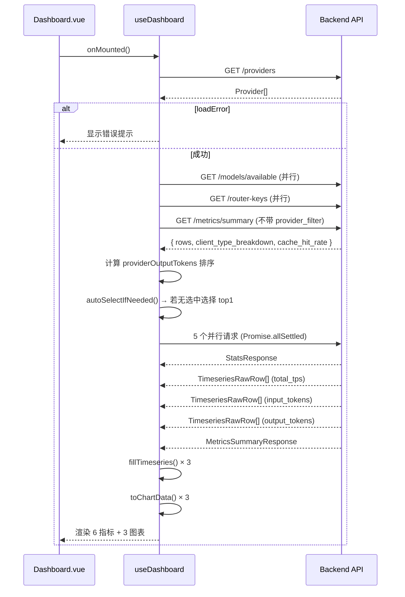
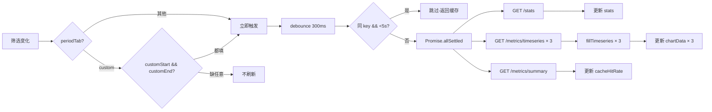
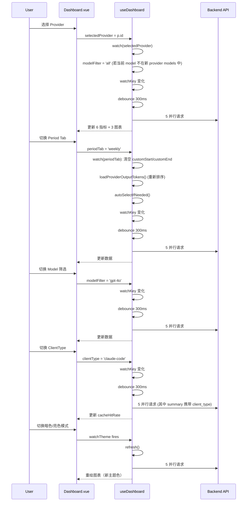

# Dashboard 页面分析

> **此文档为旧版 Dashboard 分析。** 新版 4-zone 设计文档见 [`docs/design/dashboard-redesign.md`](../design/dashboard-redesign.md)。

## 文件结构

| 文件 | 行数 | 角色 |
|------|------|------|
| `frontend/src/views/Dashboard.vue` | ~325 | 视图层：模板 + Chart.js 初始化 + 组件注册 |
| `frontend/src/composables/useDashboard.ts` | ~350 | 逻辑层：筛选状态、数据加载、刷新调度 |
| `frontend/src/views/metrics-helpers.ts` | ~150 | 工具层：时间序列填充、Chart.js 配置生成 |
| `frontend/src/styles/design-tokens.ts` | ~35 | 颜色常量：CHART_COLORS |
| `frontend/src/utils/format.ts` | ~80 | 时间格式化：parseUtc、formatTimeShort、formatTimeHM、formatTimeMDH、toIsoStart、toIsoEnd |

## 模板结构

```
div.p-6
├── 顶部行: h2 + Button 按钮组（Provider 切换）
├── 时间粒度 Tab: 4 个 Button（window / weekly / monthly / custom）
├── 时间范围:
│   ├── custom 模式 → 2 个 datetime-local Input（w-44）
│   └── 其他模式 → timeRangeText span
├── 筛选栏: 3 个 Select
│   ├── modelFilter（w-44, allModels 选项）
│   ├── keyFilter（w-48, routerKey 选项）  
│   └── clientType（w-40, 6 个固定选项）
├── 数据区域:
│   ├── loadError → 居中提示 + retry Button
│   ├── loading → 居中 "Loading..." 文本
│   └── 正常数据:
│       ├── 6 指标卡片 grid(2/3/6 响应式)
│       │   ├── totalRequests (toLocaleString)
│       │   ├── successRate (×100→%, text-success)
│       │   ├── avgTps (toFixed(1) + "t/s")
│       │   ├── totalInputTokens (toLocaleString)
│       │   ├── totalOutputTokens (toLocaleString)
│       │   └── cacheHitRate (toFixed(1)%, text-primary, 或无数据提示)
│       └── 3 图表 grid(1/3 响应式)
│           ├── TPS 折线图 (indigo)
│           ├── InputTokens 折线图 (teal)
│           └── OutputTokens 折线图 (green)
│           └── 每个图表: Card > CardHeader(CardTitle) > CardContent(div.h-56 > Line)
```

### 组件依赖

| shadcn-vue 组件 | 用途 |
|-----------------|------|
| Button | Provider 按钮组、Period Tab、Retry 按钮 |
| Card / CardContent / CardHeader / CardTitle | 指标卡片、图表容器 |
| Input | 自定义日期范围输入 |
| Select / SelectTrigger / SelectContent / SelectItem | 模型、密钥、客户端类型筛选 |

| 第三方库 / 内部组件 | 用途 |
|---------------------|------|
| Chart.js (line) | 折线图渲染 |
| vue-chartjs (Line) | Chart.js Vue 封装组件 |
| vue-sonner (toast) | 错误提示 |
| vue-i18n (useI18n) | 国际化 |

## Composable 架构

```
useDashboard()
├── 顶层状态
│   ├── providers: Ref<Provider[]>
│   ├── selectedProvider: Ref<string>
│   ├── periodTab: Ref<'window'|'weekly'|'monthly'|'custom'> (default: 'window')
│   ├── customStart: Ref<string> (default: '')
│   └── customEnd: Ref<string> (default: '')
│
├── useDashboardFilters(...)
│   ├── 筛选状态:
│   │   ├── modelFilter: Ref<string> (default: 'all')
│   │   ├── keyFilter: Ref<string> (default: 'all')
│   │   ├── clientType: Ref<string> (default: 'all')
│   │   ├── allModelOptions: Ref<string[]>
│   │   └── keyOptions: Ref<{id, name}[]>
│   ├── 派生 Computed:
│   │   ├── modelOptions: 按 selectedProvider 过滤 allModelOptions
│   │   ├── apiStartTime: custom 模式 → toIsoStart(customStart)
│   │   ├── apiEndTime: custom 模式 → toIsoEnd(customEnd)
│   │   ├── statsParams: 组装请求参数（不含 clientType）
│   │   ├── cacheSummaryParams: 组装请求参数（含 clientType）
│   │   ├── timeseriesPeriod: custom → 'monthly', 否则传透
│   │   └── tsParams(metric): 单指标时间序列参数
│   └── loadFilterOptions(): 并行加载 model/密钥列表
│
├── useDashboardData(...)
│   ├── 数据状态:
│   │   ├── stats: Ref<DashboardStats>
│   │   ├── cacheHitRate: Ref<number>
│   │   ├── clientTypeBreakdown: Ref<Record<string, number>>
│   │   ├── tpsChartData / inputTokensChartData / outputTokensChartData: Ref<ChartData<'line'> | null>
│   │   ├── loading: Ref<boolean>
│   │   ├── loadError: Ref<boolean>
│   │   └── providerOutputTokens: Ref<Record<string, number>>
│   ├── 工具函数:
│   │   └── toChartData(timeseries, label, color): ChartData<'line'>
│   ├── 数据加载:
│   │   ├── loadProviders(): GET /providers
│   │   ├── loadProviderOutputTokens(): GET /metrics/summary → 按 provider 汇总 output_tokens
│   │   └── refresh(): 核心刷新函数
│   └── 缓存策略:
│       ├── DEBOUNCE_MS = 300
│       ├── CACHE_TTL = 5000
│       └── watchKey = JSON.stringify(所有筛选参数)
│
├── 派生状态:
│   ├── sortedProviders: 按 providerOutputTokens 降序排序
│   ├── timeRangeText: "formatTimeShort(start) ~ formatTimeShort(end)"
│   └── periodTabs: 4 个 {label, value} 对象
│
├── 副作用 Watchers:
│   ├── watch(periodTab) → 非 custom 模式清空日期
│   ├── watch(selectedProvider) → 重置 modelFilter
│   ├── watch(periodTab) → 重新 loadProviderOutputTokens + autoSelectIfNeeded
│   └── watch(watchKey) → debounce 300ms → refresh()
│
├── 生命周期:
│   ├── onMounted:
│   │   loadProviders() → loadFilterOptions() → loadProviderOutputTokens() → autoSelectIfNeeded() → refresh()
│   │   + 注册 watchTheme(refresh)
│   └── onUnmounted: 清理 refreshTimer + watchTheme 取消函数
│
└── 导出: providers, selectedProvider, sortedProviders, periodTab, customStart,
           customEnd, modelFilter, keyFilter, clientType, modelOptions, keyOptions,
           timeRangeText, stats, loading, loadError, cacheHitRate, clientTypeBreakdown,
           tpsChartData, inputTokensChartData, outputTokensChartData, retry
```

### DashboardStats 类型

```typescript
interface DashboardStats {
  totalRequests: number;
  successRate: number;
  avgTps: number;
  totalInputTokens: number;
  totalOutputTokens: number;
  startTime: string | null;
  endTime: string | null;
}
```

## API 调用链路

### 初始加载顺序（串行）



### 筛选变化刷新链路



### 参数构造逻辑

```
statsParams (computed):
  period?      → periodTab (非 custom)
  start_time?  → custom 模式
  end_time?    → custom 模式
  provider_id? → selectedProvider
  backend_model? → modelFilter (非 all)
  router_key_id? → keyFilter (非 all)
  // 不含 clientType

cacheSummaryParams (computed):
  // 与 statsParams 结构相同 + 额外
  client_type? → clientType (非 all)

tsParams(metric) (function):
  metric       → 参数
  period?      → periodTab (非 custom)
  start_time?  → custom 模式
  end_time?    → custom 模式
  provider_id? → selectedProvider
  backend_model? → modelFilter (非 all)
  router_key_id? → keyFilter (非 all)
  // 不含 clientType
```

## 时间序列填充（fillTimeseries）

### PERIOD_TOTAL_SEC 映射

| periodStr | totalSec | 说明 |
|-----------|----------|------|
| 1h | 3600 | 1 小时（未使用） |
| 5h / window | 18000 | 5 小时（默认） |
| 6h | 21600 | 未使用 |
| 24h | 86400 | 未使用 |
| 7d / weekly | 604800 | 7 天 |
| 30d / monthly | 2592000 | 30 天 |

### 填充算法

```mermaid
flowchart TD
    A[fillTimeseries(raw, periodStr, timeRange?)] --> B{有 timeRange?}
    B -->|是| C[用 timeRange 计算 startMs / endMs]
    B -->|否| D[用 now - totalSec 计算]
    C --> E[calcBucketSec(totalSec)]
    D --> E
    E --> F[分成等间距 bucket, bucketMs = bucketSec × 1000]
    F --> G[raw 按 time_bucket 分组到 Map<key, row>]
    G --> H[遍历每个 bucket]
    H --> I{map 中有此 bucket?}
    I -->|有| J[row.avg_value]
    I -->|无| K[0]
    J --> L[push label + value]
    K --> L
    L --> M[返回 {labels, values}]
```

### bucket 自适应

- `bucketSec = max(60, round(totalSec / 10))`
- custom 模式时 `totalSec` 从 `timeRange.endTime - timeRange.startTime` 计算，而非 PERIOD_TOTAL_SEC
- 非 custom 模式时 `totalSec` 取 PERIOD_TOTAL_SEC[periodStr]（默认 86400）
- bucket 数量 = round((endMs - startMs) / bucketMs)

### 标签格式选择

| 条件 | 格式 | 函数 |
|------|------|------|
| lastTs - firstTs > 4 天 | 月日时分 | formatTimeMDH |
| 其余 | 时分 | formatTimeHM |
| 无 timeRange 时 | 按 periodStr 是否为 '7d'/'30d'/'weekly'/'monthly' | 同上 |

### tick 刻度选择

- `TICK_COUNT = 5`
- 均匀选取 5 个刻度（含首尾）
- 总 bucket ≤ 5 时显示全部
- X 轴 `maxRotation=0, autoSkip=false`
- 未选中的刻度通过 `callback` 返回空字符串隐藏

## 图表配置（lineOptions）

### 基本配置

| 属性 | 值 |
|------|-----|
| responsive | true |
| maintainAspectRatio | false |
| interaction.mode | 'index' |
| interaction.intersect | false |
| legend.display | false |
| tension | 0.4（dataset 层设置） |
| pointRadius | 0（dataset 层设置） |
| fill | false（dataset 层设置） |

### Tooltip

- mode: 'index' — 显示该 x 位置所有数据集
- callback: `${parsed.y} ${unit}` — unit 默认为空字符串

### Axes

| 轴 | grid | ticks | 特殊 |
|----|------|-------|------|
| X | display: false | maxRotation: 0, autoSkip: false, callback: 仅显示 TICK_COUNT 个 | — |
| Y | beginAtZero: true, grid color 自适应主题 | color 自适应主题 | — |

### 颜色自适应

- `chartThemeColors()` 检测 `document.documentElement.classList.contains('dark')`
- 暗色模式：gridColor = `oklch(1 0 0 / 10%)`, tickColor = `oklch(0.708 0 0)`
- 亮色模式：gridColor = `oklch(0.922 0 0)`, tickColor = `oklch(0.556 0 0)`

### stackedAreaOptions（已定义但未使用）

- 与 lineOptions 类似，但启用 `scales.x.stacked=true` + `scales.y.stacked=true`
- legend 显示在底部
- 预留给未来合并图表使用

## CHART_COLORS

```typescript
export const CHART_COLORS = {
  teal:   'oklch(0.58 0.14 175)',    // InputTokens 折线图
  indigo: 'oklch(0.65 0.14 260)',    // TPS 折线图
  green:  'oklch(0.65 0.17 150)',    // OutputTokens 折线图
}
```

背景色（`backgroundColor`）由 `color.replace(")", " / 0.1)")` 动态生成 10% 透明度版本。当前 fill=false 因此背景色不生效。

## 数据流完整时序图



## 交互模式

| 交互元素 | 实现方式 | 反馈 |
|---------|---------|------|
| Provider 切换 | Button 按钮组, variant=default/ghost | 重置 modelFilter, 300ms debounce 后刷新 |
| Period Tab 切换 | Button 按钮组, variant=default/ghost | 非 custom 清空日期, 重新排序 provider, auto-select, 300ms debounce |
| Model 筛选 | Select 下拉框 | 300ms debounce 后刷新 |
| Key 筛选 | Select 下拉框 | 300ms debounce 后刷新 |
| ClientType 筛选 | Select 下拉框 | 300ms debounce 后刷新（影响 cacheHitRate） |
| 自定义日期 | 2 个 datetime-local Input | 两个都填完 → watchKey 变化 → debounce 刷新 |
| 失败重试 | Button "重试" → retry() | 重新执行完整加载链路 |
| 图表 | 无交互（仅 hover tooltip） | tooltip index 模式显示精确值 |

## 缓存策略

### Debounce

- `DEBOUNCE_MS = 300` — 筛选操作连续触发时，每隔 300ms 执行最后一次
- `watchKey` 变化时 `clearTimeout(refreshTimer)` + `setTimeout(refresh, 300)`

### 请求缓存

- `CACHE_TTL = 5000` — 相同 `watchKey` 在 5 秒内跳过刷新
- 判断方式：`key === lastRefreshKey && now - lastRefreshTime < CACHE_TTL`

### watchKey

```typescript
JSON.stringify({
  periodTab,          // 时间粒度
  selectedProvider,   // 当前 provider
  modelFilter,        // 模型筛选
  keyFilter,          // 密钥筛选
  clientType,         // 客户端类型
  customStart,        // 自定义开始
  customEnd,          // 自定义结束
})
```

## 状态覆盖

| 状态 | 触发条件 | 展示 |
|------|---------|------|
| **loading** | `loading.value = true` | 居中 `text-muted-foreground` "Loading..." 文本 |
| **loadError** | `loadProviders()` 失败 | 居中错误描述 + "重试" Button (variant=outline) |
| **empty(selectedProvider)** | `!selectedProvider.value` | `refresh()` 提前 return，不触发 API 调用 |
| **empty(custom日期)** | custom 模式缺开始或结束时间 | `refresh()` 提前 return |
| **empty(chartData)** | `tpsRes.value.length === 0` | 图表卡片内显示 "暂无数据" |
| **empty(cacheHitRate)** | `stats.totalInputTokens === 0` | 显示 "暂无缓存数据"（base font-normal text-muted-foreground） |
| **noData** | `tpsChartData === null` | 图表容器内居中 `text-muted-foreground` "暂无数据" |

### 无 Provider 场景分析

初始状态下 `selectedProvider = ""`：
- `autoSelectIfNeeded()` 在 provider output tokens 加载完成后，若仍无选中则自动选择 top1
- 若 `providers.length === 0`，`selectedProvider` 保持空字符串
- `refresh()` 中 `if (!selectedProvider.value) return;` — 图表保持 null，不发送 API 请求
- 显示 6 张空指标卡片（stats 初始值全 0）和 3 个 "暂无数据" 图表

## 错误处理

### Composable 层

| 错误场景 | 处理方式 |
|---------|---------|
| loadProviders() 失败 | loadError = true, toast.error |
| loadFilterOptions() 失败 | toast.error, 降级（`/* 非关键操作 */`） |
| loadProviderOutputTokens() 失败 | toast.error, 降级（provider 排序用默认顺序） |
| refresh() 中 5 个请求任意失败 | `Promise.allSettled` 确保不级联失败, 个别失败不影响其他数据 |
| refresh() 中整体 catch | toast.error |

### View 层

- loadError 时：覆盖整个数据区域（含筛选栏下方），显示居中错误提示 + 重试按钮
- retry() 重新执行完整加载链路：loadProviders → loadFilterOptions + loadProviderOutputTokens → autoSelectIfNeeded → refresh

## 国际化 key 清单

| i18n key | 中文值 | 英文值 |
|----------|--------|--------|
| dashboard.title | 仪表盘 | Dashboard |
| dashboard.stats.totalRequests | 总请求数 | Total Requests |
| dashboard.stats.successRate | 成功率 | Success Rate |
| dashboard.stats.tokenOutputSpeed | Token 输出速度 | Token Output Speed |
| dashboard.stats.tokenInputTotal | Token 输入总量 | Token Input Total |
| dashboard.stats.tokenOutputTotal | Token 输出总量 | Token Output Total |
| dashboard.stats.cacheHitRate | 缓存命中率 | Cache Hit Rate |
| dashboard.charts.tokenOutputSpeed | Token 输出速度 (t/s) | Token Output Speed (t/s) |
| dashboard.charts.tokenInputTotal | Token 输入总量 | Token Input Total |
| dashboard.charts.tokenOutputTotal | Token 输出总量 | Token Output Total |
| dashboard.period.last5Hours | 最近5小时 | Last 5 Hours |
| dashboard.period.weekly | 本周 | This Week |
| dashboard.period.monthly | 本月 | This Month |
| dashboard.period.custom | 自定义 | Custom |
| dashboard.clientType.all | 全部 | All |
| dashboard.clientType.claude-code | Claude Code | Claude Code |
| dashboard.clientType.codex | Codex CLI | Codex CLI |
| dashboard.clientType.pi | Pi | Pi |
| dashboard.clientType.openai-sdk | OpenAI SDK | OpenAI SDK |
| dashboard.clientType.anthropic-sdk | Anthropic SDK | Anthropic SDK |
| dashboard.noCacheData | 暂无缓存数据 | No cache data |
| dashboard.loadError | 加载仪表盘失败，请检查网络连接后重试 | Failed to load dashboard. Please check your network connection. |
| dashboard.retry | 重试 | Retry |
| dashboard.loadProvidersFailed | 加载供应商列表失败 | Failed to load providers |
| dashboard.loadDashboardFailed | 加载仪表盘数据失败 | Failed to load dashboard data |
| dashboard.loadFilterFailed | 加载筛选项失败 | Failed to load filter options |
| dashboard.loadOutputTokensFailed | 加载供应商排序数据失败 | Failed to load provider ranking data |

## 响应式断点

| 断点 | 指标卡片列数 | 图表列数 |
|------|-------------|---------|
| 默认 (< sm) | 2 | 1 |
| sm (≥640px) | 3 | 1 |
| lg (≥1024px) | 6 | 3 |

## Critique 评分记录

| 维度 | 评分 | 说明 |
|------|------|------|
| Nielsen 评分 | 23/40 | — |
| AI Slop | FAIL | — |
| P0 问题 | 6 指标卡片无视觉层次、数据值未使用 mono 字体 |
| P1 问题 | 筛选器过多(5组)、3 张折线图视觉重复 |
| P2 问题 | 空状态无帮助信息、无数据新鲜度指示 |

## 组件依赖关系图

```mermaid
graph TD
    subgraph "视图层 Dashboard.vue"
        T[Template]
        S[Script Setup]
        T -->|uses| Button
        T -->|uses| Card
        T -->|uses| CardContent
        T -->|uses| CardHeader
        T -->|uses| CardTitle
        T -->|uses| Input
        T -->|uses| Select
        T -->|uses| Line
        S -->|calls| useDashboard
        S -->|calls| lineOptions
        S -->|registers| ChartJS
    end

    subgraph "逻辑层 useDashboard"
        UD[useDashboard]
        UD -->|uses| useDashboardFilters
        UD -->|uses| useDashboardData
        UD -->|imports| fillTimeseries
        UD -->|imports| CHART_COLORS
        UD -->|imports| formatTimeShort
        UD -->|imports| toIsoStart
        UD -->|imports| toIsoEnd
        UD -->|imports| watchTheme
    end

    subgraph "工具层"
        MH[metrics-helpers.ts]
        MH --> fillTimeseries
        MH --> lineOptions
        MH --> stackedAreaOptions
        MH -->|imports| parseUtc
        MH -->|imports| formatTimeHM
        MH -->|imports| formatTimeMDH
    end

    subgraph "API 层"
        API[api/client.ts]
        API --> getStats
        API --> getMetricsSummary
        API --> getMetricsTimeseries
        API --> getProviders
        API --> getRouterKeys
        API --> getAvailableModels
    end

    subgraph "样式层"
        DT[design-tokens.ts]
        DT --> CHART_COLORS
        TC[tokens.css]
        TC --> oklch 变量
    end
```

## 影响图表刷新的因素

| 触发因素 | 是否重新请求 API | 是否重新调用 fillTimeseries | 图表 key 变化 |
|---------|----------------|---------------------------|--------------|
| Provider 切换 | 是 | 是 | 是 |
| Period Tab 切换 | 是 | 是 | 是 |
| Model 筛选变化 | 是 | 是 | 否 |
| Key 筛选变化 | 是 | 是 | 否 |
| ClientType 筛选变化 | 是（影响 summary 请求）| 否 | 否 |
| 自定义日期输入 | 是 | 是 | 否 |
| 主题切换 | 是（强制刷新）| 是 | 否 |

图表的 `:key` 属性为 `'tps-' + periodTab + '-' + selectedProvider`（input/output 同理），因此 Provider 切换和 Period 切换会强制卸载并重新挂载 Line 组件。
