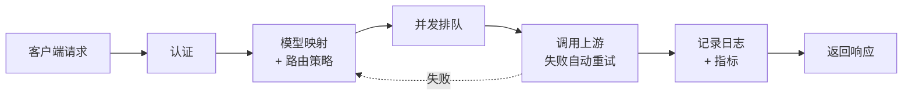

# 请求处理流水线

展示请求从接收到响应的核心流程。

## 阶段说明

| 阶段 | 做什么 |
|------|--------|
| 认证 | Bearer Token SHA256 哈希后查询 router_keys 表 |
| 模型映射 + 路由策略 | 客户端模型名映射到后端 Provider 的实际模型；支持分时段/轮询/随机/故障转移 |
| 并发排队 | Provider 级信号量，队列满返回 503，超时返回 504 |
| 调用上游 | 原生 HTTP 代理，支持 SSE 流式；失败按规则自动重试，Failover 策略下切换 Provider |
| 日志 + 指标 | 记录完整请求链路，采集 Token 用量、TTFT、TPS |
| 返回响应 | 将上游响应原样返回客户端 |

## 循环机制

- **重试**：同一 Provider 内，按重试规则（fixed/exponential 退避）自动重试可恢复错误
- **Failover**：排除失败 Provider 后回到映射解析，尝试下一个 Provider
