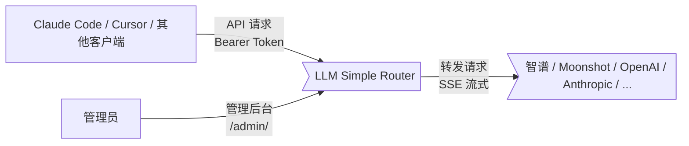

# 系统上下文图

展示 LLM Simple Router 在整体架构中的位置。

## 说明

- **客户端**通过 OpenAI 或 Anthropic 格式的 API 发送请求
- **管理员**通过浏览器访问管理后台，配置 Provider、映射规则、密钥，查看日志和监控
- **Router** 完成模型映射、并发控制、自动重试、日志记录
- **上游 Provider** 接收转发的请求，返回 SSE 流或 JSON 响应
